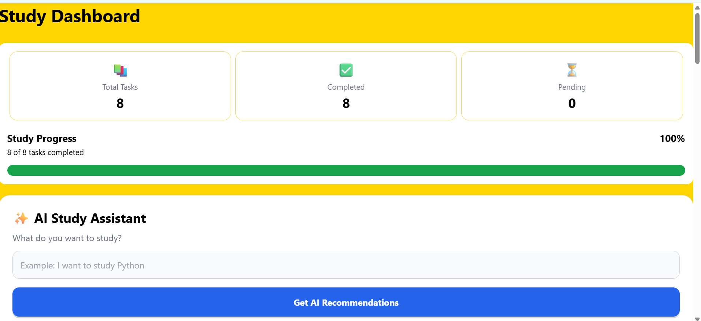
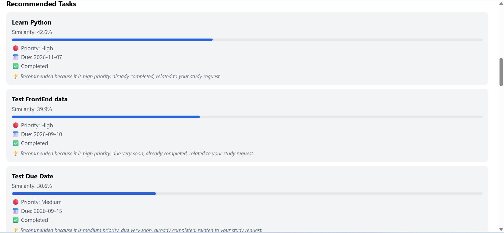

# AI Smart Study Assistant

A smart study assistant that helps students stay organized, manage their study tasks, and decide what to focus on next. It combines task management with personalized recommendations and AI-powered study advice.

## Overview

Keeping track of assignments, deadlines, and study priorities can be challenging, especially when there are multiple tasks to manage.

The AI Smart Study Assistant brings these things together in one application. It looks at a student's tasks and helps prioritize what to work on based on priority, due dates, keywords, completion status, and task similarity.

The application also uses OpenAI to provide personalized study advice based on the student's current tasks and learning needs.

## Screenshots

### Home Page


### Study Dashboard



### AI Study Advice


### Recommended Tasks



## Features

- Create and manage study tasks
- Set priorities and due dates
- Track completed and pending tasks
- Get personalized study recommendations
- Get AI-powered study advice
- Prioritize tasks based on deadlines and importance
- Find similar tasks using TF-IDF
- Match relevant tasks using keywords
- FastAPI REST API backend
- MySQL database integration
- React Native mobile application with Expo
- Automated backend testing with pytest

## How the Recommendation System Works

The recommendation system combines machine-learning techniques with task-based scoring to help identify which tasks are most relevant to the student.

It considers:

- TF-IDF similarity
- Keyword matching
- Task priority
- Due dates
- Completion status

These factors are combined to rank tasks and help the student decide what to focus on next.

The main recommendation logic runs locally using TF-IDF, keyword matching, and task scoring. OpenAI is used separately when AI-generated study guidance is useful. This keeps the system efficient and avoids unnecessary API usage.

## AI Integration

OpenAI is used to generate personalized study advice based on the student's current tasks and study needs.

The AI can suggest what to focus on and provide practical guidance for approaching study tasks.

The AI functionality is kept separate from the core recommendation system, which handles task ranking using TF-IDF, keyword matching, and task-based scoring.

## Tech Stack

### Frontend

- React Native
- Expo
- TypeScript

### Backend

- Python
- FastAPI
- Pytest

### Database

- MySQL

### AI & Machine Learning

- OpenAI API
- TF-IDF
- Keyword Matching
- Recommendation Scoring

## Project Structure

```text
ai-smart-study-assistant/
│
├── backend/
│   ├── app/
│   │   ├── __init__.py
│   │   ├── ai.py
│   │   ├── main.py
│   │   ├── models.py
│   │   └── test_main.py
│   ├── requirements.txt
│   └── .gitignore
│
├── database/
│
├── frontend/
│   ├── src/
│   │   ├── app/
│   │   └── components/
│   ├── assets/
│   ├── package.json
│   ├── package-lock.json
│   └── .gitignore
│
├── screenshots/
│   ├── home.png
│   ├── dashboard.png
│   ├── ai-advice.png
│   └── recommendations.png
│
├── .gitignore
└── README.md
Getting Started
1. Clone the Repository
git clone https://github.com/tata-lakshman/ai-smart-study-assistant.git
cd ai-smart-study-assistant
2. Backend Setup

Go to the backend directory:

cd backend

Create a Python virtual environment:

python -m venv venv

Activate the virtual environment on Windows:

venv\Scripts\activate

Install the required dependencies:

pip install -r requirements.txt
3. Environment Variables

Create a .env file inside the backend directory and add your own configuration:

OPENAI_API_KEY=your_openai_api_key
MYSQL_PASSWORD=your_mysql_password

Never commit your .env file, API keys, database passwords, or other secrets to GitHub.

4. Start the Backend

From the backend directory, run:

uvicorn app.main:app --reload

The FastAPI backend will start locally.

5. Frontend Setup

Open a new terminal and go to the frontend directory:

cd frontend

Install the dependencies:

npm install

Start the Expo development server:

npx expo start

You can then run the application using an available Expo development option.

Testing

The backend includes automated tests using pytest.

From the backend directory, run:

pytest

The test suite covers API functionality and error-handling scenarios.

Security

Sensitive and generated files are excluded from version control using .gitignore.

The repository does not include:

.env
Python virtual environments
node_modules
Expo generated files
__pycache__
.pytest_cache

API keys and database credentials should always be stored in environment variables and should never be committed to the repository.

Future Improvements

Some ideas for future versions include:

User authentication
Personalized study plans
Study progress analytics
Learning streaks
Improved recommendation ranking
More detailed AI-generated study plans
Cloud deployment
Additional database and performance optimizations
Project Status

The core application is currently working with:

React Native + Expo frontend
FastAPI backend
MySQL database
OpenAI integration
AI study recommendations
AI-generated study advice
Automated backend testing
Author

Tata Lakshman Kumar

Aspiring AI/ML Engineer interested in Artificial Intelligence, Machine Learning, Generative AI, and building practical AI-powered applications.
